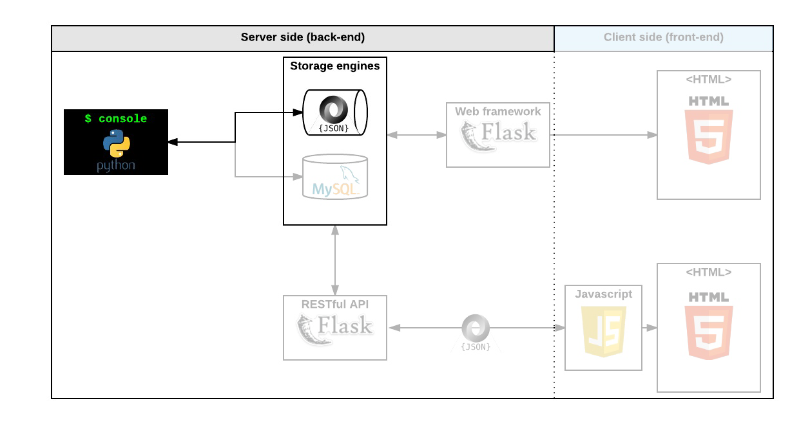

# 0x00. AirBnB clone - The console
## First step: Write a command interpreter to manage your AirBnB objects.
This is the first step towards building your first full web application: the AirBnB clone. This first step is very important because you will use what you build during this project with all other following projects: HTML/CSS templating, database storage, API, front-end integration…

Each task is linked and will help you to:
- put in place a parent class (called `BaseModel`) to take care of the initialization, serialization and deserialization of your future instances
- create a simple flow of serialization/deserialization: Instance <-> Dictionary <-> JSON string <-> file
- create all classes used for AirBnB (`User`, `State`, `City`, `Place`) that inherit from `BaseModel`
- create the first abstracted storage engine of the project: File storage.
- create all unittests to validate all our classes and storage engine

## What’s a command interpreter?
Do you remember the Shell? It’s exactly the same but limited to a specific use-case. In our case, we want to be able to manage the objects of our project:

- Create a new object (ex: a new User or a new Place)
- Retrieve an object from a file, a database etc…
- Do operations on objects (count, compute stats, etc…)
- Update attributes of an object
- Destroy an object

## Resources
- [cmd module](https://docs.python.org/3.8/library/cmd.html)
- [cmd module in depth](https://pymotw.com/2/cmd/)
- [uuid module](https://docs.python.org/3.8/library/uuid.html)
- [datetime](https://docs.python.org/3.8/library/datetime.html)
- [unittest module](https://docs.python.org/3.8/library/unittest.html#module-unittest)
- [args/kwargs](https://yasoob.me/2013/08/04/args-and-kwargs-in-python-explained/)
- [Python test cheatsheet](https://www.pythonsheets.com/notes/python-tests.html)
- [cmd module wiki page](https://wiki.python.org/moin/CmdModule)
- [python unittest](https://realpython.com/python-testing/)

## Learning Objectives
<details>
<summary>How to create a Python package</summary>

### Python Package
Creating a Python package involves organizing your code in a structured way and providing the necessary files so it can be easily installed and used by others. 

#### 1. Set Up the Directory Structure
Create a directory for your package. For this example, we’ll name it `mypackage`.
```plaintext
$mypackage/
├── mypackage/
│   ├── __init__.py
│   └── module1.py
├── setup.py
└── README.md
```
Here’s what each file is for:
- `mypackage/`: This is the main package directory.
- `__init__.py`: Marks `mypackage` as a Python package and can be used to initialize package-level variables.
- `module1.py`: Contains the actual code (you can add more modules if needed).
- `setup.py`: The script used to build and install your package.
- `README.md`: A markdown file that describes your package (optional but recommended).

#### 2. Add Code to Your Modules
In module1.py, add some example functions or classes:
```python
$# mypackage/module1.py

def greet(name):
    return f"Hello, {name}!"

def add(a, b):
    return a + b
```
In `__init__.py`, you can import items to expose them at the package level:
```python
$# mypackage/__init__.py

from .module1 import greet, add
```
This setup allows users to import directly from `mypackage` without needing to specify `module1`.

#### 3. Create the `setup.py` File
The `setup.py` file is essential for defining your package’s metadata, dependencies, and installation requirements.
```python
$# setup.py

from setuptools import setup, find_packages

setup(
    name="mypackage",
    version="0.1.0",
    author="Your Name",
    author_email="your.email@example.com",
    description="A simple example package",
    long_description=open("README.md").read(),
    long_description_content_type="text/markdown",
    url="https://github.com/yourusername/mypackage",
    packages=find_packages(),
    classifiers=[
        "Programming Language :: Python :: 3",
        "License :: OSI Approved :: MIT License",
        "Operating System :: OS Independent",
    ],
    python_requires=">=3.6",
)
```
**Explanation:**
- `name`: Name of the package.
- `version`: Package version.
- `author` and `author_email`: Your details.
- `description` and `long_description`: Short and detailed descriptions of the package.
- `url`: Link to the project or repository.
- `packages`: Uses `find_packages()` to automatically include subpackages.
- `classifiers`: Metadata about the package (language, license, etc.).
- `python_requires`: Minimum Python version requirement.

#### 4. Create a README.md (Optional)
In the `README.md` file, you can describe your package, installation instructions, and usage examples.

```markdown
$# MyPackage

This is a simple example Python package.

## Installation

bash
``pip install mypackage``

**Usage**
``python
from mypackage import greet, add

print(greet("Alice"))
print(add(5, 3))``

```

#### 5. Build the Package
With `setuptools` and `wheel` installed, use the following command to create distribution archives:

```bash
python3 setup.py sdist bdist_wheel`
```
This will create a `dist/` directory containing `.tar.gz` and `.whl` files that can be uploaded to PyPI or distributed.

#### 6. Installing and Testing the Package Locally
To install the package locally, use:
```bash
pip install .
```
To test it, open a Python shell and try importing and using your package:
```python
$from mypackage import greet, add

print(greet("Alice"))
print(add(5, 3))
```
#### 7. Optional: Publishing to PyPI
If you want to publish your package to PyPI, follow these steps:
1. Register an account on [PyPI](https://pypi.org/).
2. Install twine if you haven’t already: `pip install twine`
3. Use twine to upload your package: `twine upload dist/*`

Once uploaded, your package will be available on PyPI for anyone to install with `pip install yourpackage`.

</details>
<details>
<summary>How to create a command interpreter in Python using the cmd module</summary>

### Create a Command Interpreter
The `cmd` module in Python provides a framework for creating simple command-line interpreters, which are interactive shells or REPLs (Read-Eval-Print Loops). This module is especially useful if you want to build a custom shell that lets users enter commands, get responses, and perform actions within a specific program.

#### Overview of the `cmd` Module
- The `cmd` module has a `Cmd` class, which you can subclass to define custom commands.
- Each command is implemented as a method with the prefix `do_`.
- Built-in features include support for commands like `help`, history, and exiting the shell.

#### Example: Creating a Simple Command-Line Interpreter
1. Define a Class: Create a class that inherits from `cmd.Cmd`.
2. Define Commands: Define each command as a method that starts with `do_`.
3. Start the Interpreter: Use `cmdloop()` to begin the interactive session.

```python
import cmd

class SimpleShell(cmd.Cmd):
    intro = "Welcome to SimpleShell. Type help or ? to list commands.\n"
    prompt = "(shell) "

    # Basic command example
    def do_greet(self, arg):
        "Greet the user with a name."
        print(f"Hello, {arg}!")

    # Example command with multiple arguments
    def do_add(self, arg):
        "Add two numbers: add 3 4"
        try:
            numbers = map(int, arg.split())
            result = sum(numbers)
            print("Result:", result)
        except ValueError:
            print("Please enter two numbers.")

    # Exit command
    def do_exit(self, arg):
        "Exit the command interpreter."
        print("Goodbye!")
        return True  # Returning True exits the cmdloop

    # Help command override (optional)
    def do_help(self, arg):
        if arg:
            # Print help for a specific command
            cmd.Cmd.do_help(self, arg)
        else:
            # Custom help for all commands
            print("Available commands:\n - greet <name>\n - add <num1> <num2>\n - exit")

# Running the command loop
if __name__ == '__main__':
    SimpleShell().cmdloop()
```

#### Using the Command Interpreter
When you run this code, you’ll see a shell with the `(shell)` prompt:
```plaintext
Welcome to SimpleShell. Type help or ? to list commands.

(shell) greet Alice
Hello, Alice!

(shell) add 5 7
Result: 12

(shell) exit
Goodbye!
```
#### Summary of Key Features in cmd
- `do_<command>` Methods: Each command is defined as a `do_<command>` method.
- `cmdloop()`: Starts the interpreter loop and waits for user input.
- Built-in Help: Users can type `help` or `?` for help information on commands.
- Exit the Loop: Return `True` in any `do_` method to exit the interpreter.

The `cmd` module is powerful for building simple command-line tools, interactive environments, or REPLs for customized scripts.
</details>
<details>
<summary>How to serialize and deserialize a Class</summary>

### Serialize and Deserialize a Class
In Python, serialization is the process of converting an object into a format that can be stored or transmitted (e.g., to a file or over a network), while deserialization is the process of converting this data back into an object. Common formats for serialization include JSON, pickle, and XML. Python provides several libraries to handle these processes, with `pickle` and `json` being the most commonly used.

#### Using `pickle` for Serialization and Deserialization
The `pickle` module in Python can serialize and deserialize any Python object, including custom classes.

##### 1. Define the Class:
```python
import pickle

class MyClass:
    def __init__(self, name, age):
        self.name = name
        self.age = age

    def __repr__(self):
        return f"MyClass(name={self.name}, age={self.age})"
```
##### 2. Serialize the Object:
```python
# Create an instance of the class
obj = MyClass("Alice", 30)

# Serialize to a file
with open("myclass.pkl", "wb") as f:
    pickle.dump(obj, f)
```
##### 3. Deserialize the Object:
```python
# Deserialize from the file
with open("myclass.pkl", "rb") as f:
    loaded_obj = pickle.load(f)

print(loaded_obj)  # Output: MyClass(name=Alice, age=30)
```
#### Using JSON for Serialization and Deserialization
The `json` module only supports basic data types (like dictionaries, lists, strings, numbers) and requires converting class attributes to JSON-compatible structures.

##### 1. Define the Class with `__dict__`:
```python
import json

class MyClass:
    def __init__(self, name, age):
        self.name = name
        self.age = age

    def to_json(self):
        return json.dumps(self.__dict__)

    @classmethod
    def from_json(cls, data):
        data_dict = json.loads(data)
        return cls(**data_dict)
```
##### 2. Serialize the Object to JSON:
```python
obj = MyClass("Bob", 25)
json_str = obj.to_json()
print(json_str)  # Output: {"name": "Bob", "age": 25}
```
##### 3. Deserialize the Object from JSON:
```python
loaded_obj = MyClass.from_json(json_str)
print(loaded_obj)  # Output: MyClass(name=Bob, age=25)
```
#### Using dataclasses with JSON
With Python 3.7+, `dataclasses` make it easy to create classes with built-in serialization support.
```python
from dataclasses import dataclass, asdict
import json

@dataclass
class MyClass:
    name: str
    age: int

    def to_json(self):
        return json.dumps(asdict(self))

    @classmethod
    def from_json(cls, data):
        return cls(**json.loads(data))

# Example usage
obj = MyClass("Charlie", 40)
json_str = obj.to_json()
loaded_obj = MyClass.from_json(json_str)

print(json_str)  # JSON string representation
print(loaded_obj)  # Deserialized object
```
#### Choosing Between Pickle and JSON
- `pickle`: Suitable for any Python object, including complex types. It is Python-specific and may not be secure with untrusted sources, as it can execute arbitrary code.
- `json`: Suitable for basic data types and interoperable with other programming languages. Safe for public data transfer but does not support complex Python objects directly.
</details>
<details>
<summary>How to manage datetime</summary>

### How to manage datetime
In Python, the `datetime` module is the primary way to work with dates and times. It provides classes and methods for managing dates, times, time zones, and more.
#### 1. Basic Usage of `datetime` and `date`
To work with the current date and time:
```python
from datetime import datetime, date

# Get the current date and time
now = datetime.now()
print("Current date and time:", now)

# Get only the current date
today = date.today()
print("Today's date:", today)
```
#### 2. Creating Specific Dates and Times
```python
from datetime import datetime

# Create a specific date and time
specific_date = datetime(2023, 11, 9, 14, 30, 0)  # Year, month, day, hour, minute, second
print("Specific date and time:", specific_date)
```
#### 3. Formatting Dates and Times as Strings
Use `strftime` to format `datetime` objects as strings:
```python
from datetime import datetime

now = datetime.now()

# Format date and time
formatted = now.strftime("%Y-%m-%d %H:%M:%S")
print("Formatted:", formatted)
```
**Common Formatting Codes:**
- `%Y`: Year (4 digits)
- `%m`: Month (2 digits)
- `%d`: Day (2 digits)
- `%H`: Hour (24-hour format)
- `%M`: Minute
- `%S`: Second

#### 4. Parsing Dates and Times from Strings
Use `strptime` to convert a string into a `datetime` object:
```python
from datetime import datetime

date_str = "2023-11-09 14:30:00"
parsed_date = datetime.strptime(date_str, "%Y-%m-%d %H:%M:%S")
print("Parsed date and time:", parsed_date)
```
#### 5. Date Calculations and Time Differences
Use `timedelta` to perform date and time calculations:
```python
from datetime import datetime, timedelta

now = datetime.now()

# Add 5 days
future_date = now + timedelta(days=5)
print("5 days from now:", future_date)

# Calculate time difference
difference = future_date - now
print("Difference:", difference.days, "days")
```
#### 6. Time Zones
To work with time zones, you can use `pytz`, a third-party library that provides time zone support:
```python
from datetime import datetime
import pytz

utc_now = datetime.now(pytz.UTC)  # Get current UTC time
print("Current UTC time:", utc_now)

# Convert to a specific time zone
est_now = utc_now.astimezone(pytz.timezone("America/New_York"))
print("Eastern time:", est_now)
```
</details>
<details>
<summary>What is an UUID</summary>

### UUID
A UUID (Universally Unique Identifier) is a 128-bit value used to uniquely identify information in a distributed system or application. It is designed to be globally unique, ensuring that each identifier generated will not clash with another, even across different systems and times.

UUIDs are often used in applications that need unique identifiers for records, such as databases, web sessions, or when creating distributed systems where multiple machines generate IDs independently.

#### UUID Structure
A UUID is typically represented as a 32-character hexadecimal string, divided into five sections by hyphens. The format is:
``xxxxxxxx-xxxx-xxxx-xxxx-xxxxxxxxxxxx``

Where each `x` is a hexadecimal digit (`0-9`, `a-f`). The 128-bit value is divided into the following parts:
- **8 characters** for the first part
- **4 characters** for the second part
- **4 characters** for the third part
- **4 characters** for the fourth part
- **12 characters** for the last part

#### Types of UUIDs
There are several versions of UUIDs, with the most commonly used being:

##### 1. UUIDv1 (Time-based UUID):
- Generated using the current timestamp and the MAC address of the machine, ensuring uniqueness over time and across systems.
- Example: `d44b635e-46d0-11ec-bc89-43a7a10ed9c4`

##### 2. UUIDv4 (Random UUID):
- Generated using random numbers. It is the most commonly used type as it provides a high degree of randomness and is not based on time or machine information.
- Example: `ed55b0d1-d88e-4c9b-8282-91eb5c51276b`

##### 3. UUIDv3 (Name-based UUID using MD5 hash):
- Generated by hashing a namespace identifier and a name using MD5.
- Example: `a9e03b09-049d-3b8d-9829-f60ef4fd1081`

##### 4. UUIDv5 (Name-based UUID using SHA-1 hash):
- Similar to UUIDv3 but uses the SHA-1 hash algorithm instead of MD5.
- Example: `af69bfb9-bd91-55db-b7b4-56f43c14bb17`

#### When to Use UUIDs
- **Database keys:** They are useful as primary keys in databases, where you need unique identifiers that do not rely on auto-incrementing integers.
- **Distributed systems:** UUIDs help when you have multiple systems generating IDs independently and need to ensure that the IDs are globally unique.
- **Session identifiers:** Web applications use UUIDs to uniquely identify sessions, users, and other objects that require unique identifiers.

#### Generating a UUID in Python
```python
import uuid

# Generate a random UUID (UUIDv4)
random_uuid = uuid.uuid4()
print("Random UUIDv4:", random_uuid)

# Generate a UUID based on a name (UUIDv5)
namespace = uuid.NAMESPACE_DNS
name = "example.com"
name_based_uuid = uuid.uuid5(namespace, name)
print("Name-based UUIDv5:", name_based_uuid)
```
</details>

## More Info
Execution
Your shell should work like this in interactive mode:
```bash
$ ./console.py
(hbnb) help

Documented commands (type help <topic>):
========================================
EOF  help  quit

(hbnb) 
(hbnb) 
(hbnb) quit
```
But also in non-interactive mode: (like the Shell project in C)
```bash
$ echo "help" | ./console.py
(hbnb)

Documented commands (type help <topic>):
========================================
EOF  help  quit
(hbnb) 
$
$ cat test_help
help
$
$ cat test_help | ./console.py
(hbnb)

Documented commands (type help <topic>):
========================================
EOF  help  quit
(hbnb) 
```
All tests should also pass in non-interactive mode: `$ echo "python3 -m unittest discover tests" | bash`


## Tasks
### 0. README, AUTHORS
- Write a `README.md`:
    + description of the project
    + description of the command interpreter:
        - how to start it
        - how to use it
        - examples
- You should have an `AUTHORS` file at the root of your repository, listing all individuals having contributed content to the repository. For format, reference Docker’s AUTHORS page
- You should use branches and pull requests on GitHub - it will help you as team to organize your work

### 1. Be pycodestyle compliant!
Write beautiful code that passes the pycodestyle checks.

### 2. Unittests
All your files, classes, functions must be tested with unit tests
```bash
$ python3 -m unittest discover tests
...................................................................................
...................................................................................
.......................
----------------------------------------------------------------------
Ran 189 tests in 13.135s

OK
```
*Note that this is just an example, the number of tests you create can be different from the above example.*

**Warning**:

Unit tests must also pass in non-interactive mode:
```bash
$ echo "python3 -m unittest discover tests" | bash
...................................................................................
...................................................................................
.......................
----------------------------------------------------------------------
Ran 189 tests in 13.135s

OK
```

### 3. BaseModel
Write a class `BaseModel` that defines all common attributes/methods for other classes:
- `models/base_model.py`
- Public instance attributes:
    + `id`: string - assign with an `uuid` when an instance is created:
        - you can use `uuid.uuid4()` to generate unique `id` but don’t forget to convert to a string
        - the goal is to have unique `id` for each `BaseModel`
    + `created_at`: datetime - assign with the current datetime when an instance is created
    + `updated_at`: datetime - assign with the current datetime when an instance is created and it will be updated every time you change your object
- `__str__`: should print: `[<class name>] (<self.id>) <self.__dict__>`
- Public instance methods:
    + `save(self)`: updates the public instance attribute `updated_at` with the current datetime
    + `to_dict(self)`: returns a dictionary containing all keys/values of `__dict__` of the instance:
        - by using `self.__dict__`, only instance attributes set will be returned
        - a key `__class__` must be added to this dictionary with the class name of the object
        - `created_at` and `updated_at` must be converted to string object in ISO format:
            + format: `%Y-%m-%dT%H:%M:%S.%f` (ex: `2017-06-14T22:31:03.285259`)
            + you can use `isoformat()` of `datetime` object
        - This method will be the first piece of the serialization/deserialization process: create a dictionary representation with “simple object type” of our `BaseModel`
```bash
$ cat test_base_model.py
#!/usr/bin/python3
from models.base_model import BaseModel

my_model = BaseModel()
my_model.name = "My First Model"
my_model.my_number = 89
print(my_model)
my_model.save()
print(my_model)
my_model_json = my_model.to_dict()
print(my_model_json)
print("JSON of my_model:")
for key in my_model_json.keys():
    print("\t{}: ({}) - {}".format(key, type(my_model_json[key]), my_model_json[key]))

$ ./test_base_model.py
[BaseModel] (b6a6e15c-c67d-4312-9a75-9d084935e579) {'my_number': 89, 'name': 'My First Model', 'updated_at': datetime.datetime(2017, 9, 28, 21, 5, 54, 119434), 'id': 'b6a6e15c-c67d-4312-9a75-9d084935e579', 'created_at': datetime.datetime(2017, 9, 28, 21, 5, 54, 119427)}
[BaseModel] (b6a6e15c-c67d-4312-9a75-9d084935e579) {'my_number': 89, 'name': 'My First Model', 'updated_at': datetime.datetime(2017, 9, 28, 21, 5, 54, 119572), 'id': 'b6a6e15c-c67d-4312-9a75-9d084935e579', 'created_at': datetime.datetime(2017, 9, 28, 21, 5, 54, 119427)}
{'my_number': 89, 'name': 'My First Model', '__class__': 'BaseModel', 'updated_at': '2017-09-28T21:05:54.119572', 'id': 'b6a6e15c-c67d-4312-9a75-9d084935e579', 'created_at': '2017-09-28T21:05:54.119427'}
JSON of my_model:
    my_number: (<class 'int'>) - 89
    name: (<class 'str'>) - My First Model
    __class__: (<class 'str'>) - BaseModel
    updated_at: (<class 'str'>) - 2017-09-28T21:05:54.119572
    id: (<class 'str'>) - b6a6e15c-c67d-4312-9a75-9d084935e579
    created_at: (<class 'str'>) - 2017-09-28T21:05:54.119427

```

### 4. Create BaseModel from dictionary
Previously we created a method to generate a dictionary representation of an instance (method `to_dict()`).

Now it’s time to re-create an instance with this dictionary representation.
`<class 'BaseModel'> -> to_dict() -> <class 'dict'> -> <class 'BaseModel'>`
Update `models/base_model.py`:
- `__init__(self, *args, **kwargs)`:
    - you will use `*args`, `**kwargs` arguments for the constructor of a `BaseModel`. (more information inside the AirBnB clone concept page)
    - `*args` won’t be used
    - if `kwargs` is not empty:
        + each key of this dictionary is an attribute name (Note `__class__` from `kwargs` is the only one that should not be added as an attribute. See the example output, below)
        + each value of this dictionary is the value of this attribute name
        + Warning: `created_at` and `updated_at` are strings in this dictionary, but inside your `BaseModel` instance is working with `datetime` object. You have to convert these strings into `datetime` object. Tip: you know the string format of these datetime
    - otherwise:
        + create `id` and `created_at` as you did previously (new instance)
```bash
$ cat test_base_model_dict.py
#!/usr/bin/python3
from models.base_model import BaseModel

my_model = BaseModel()
my_model.name = "My_First_Model"
my_model.my_number = 89
print(my_model.id)
print(my_model)
print(type(my_model.created_at))
print("--")
my_model_json = my_model.to_dict()
print(my_model_json)
print("JSON of my_model:")
for key in my_model_json.keys():
    print("\t{}: ({}) - {}".format(key, type(my_model_json[key]), my_model_json[key]))

print("--")
my_new_model = BaseModel(**my_model_json)
print(my_new_model.id)
print(my_new_model)
print(type(my_new_model.created_at))

print("--")
print(my_model is my_new_model)

$ ./test_base_model_dict.py
56d43177-cc5f-4d6c-a0c1-e167f8c27337
[BaseModel] (56d43177-cc5f-4d6c-a0c1-e167f8c27337) {'id': '56d43177-cc5f-4d6c-a0c1-e167f8c27337', 'created_at': datetime.datetime(2017, 9, 28, 21, 3, 54, 52298), 'my_number': 89, 'updated_at': datetime.datetime(2017, 9, 28, 21, 3, 54, 52302), 'name': 'My_First_Model'}
<class 'datetime.datetime'>
--
{'id': '56d43177-cc5f-4d6c-a0c1-e167f8c27337', 'created_at': '2017-09-28T21:03:54.052298', '__class__': 'BaseModel', 'my_number': 89, 'updated_at': '2017-09-28T21:03:54.052302', 'name': 'My_First_Model'}
JSON of my_model:
    id: (<class 'str'>) - 56d43177-cc5f-4d6c-a0c1-e167f8c27337
    created_at: (<class 'str'>) - 2017-09-28T21:03:54.052298
    __class__: (<class 'str'>) - BaseModel
    my_number: (<class 'int'>) - 89
    updated_at: (<class 'str'>) - 2017-09-28T21:03:54.052302
    name: (<class 'str'>) - My_First_Model
--
56d43177-cc5f-4d6c-a0c1-e167f8c27337
[BaseModel] (56d43177-cc5f-4d6c-a0c1-e167f8c27337) {'id': '56d43177-cc5f-4d6c-a0c1-e167f8c27337', 'created_at': datetime.datetime(2017, 9, 28, 21, 3, 54, 52298), 'my_number': 89, 'updated_at': datetime.datetime(2017, 9, 28, 21, 3, 54, 52302), 'name': 'My_First_Model'}
<class 'datetime.datetime'>
--
False
``` 
### 5. Store first object
Now we can recreate a BaseModel from another one by using a dictionary representation:

`<class 'BaseModel'> -> to_dict() -> <class 'dict'> -> <class 'BaseModel'>`
It’s great but it’s still not persistent: every time you launch the program, you don’t restore all objects created before… The first way you will see here is to save these objects to a file.

Writing the dictionary representation to a file won’t be relevant:
- Python doesn’t know how to convert a string to a dictionary (easily)
- It’s not human readable
- Using this file with another program in Python or other language will be hard.

So, you will convert the dictionary representation to a JSON string. JSON is a standard representation of a data structure. With this format, humans can read and all programming languages have a JSON reader and writer.

Now the flow of serialization-deserialization will be:
`<class 'BaseModel'> -> to_dict() -> <class 'dict'> -> JSON dump -> <class 'str'> -> FILE -> <class 'str'> -> JSON load -> <class 'dict'> -> <class 'BaseModel'>`

Magic right?

Terms:
- **simple Python data structure:** Dictionaries, arrays, number and string. ex: `{ '12': { 'numbers': [1, 2, 3], 'name': "John" } }`
- **JSON string representation:** String representing a simple data structure in JSON format. ex: `'{ "12": { "numbers": [1, 2, 3], "name": "John" } }'`

Write a class `FileStorage` that serializes instances to a JSON file and deserializes JSON file to instances:
- `models/engine/file_storage.py`
- Private class attributes:
    + `__file_path`: string - path to the JSON file (ex: `file.json`)
    + `__objects`: dictionary - empty but will store all objects by `<class name>.id` (ex: to store a `BaseModel` object with `id=12121212`, the key will be `BaseModel.12121212`)
- Public instance methods:
    + `all(self)`: returns the dictionary `__objects`
    + `new(self, obj)`: sets in `__objects` the `obj` with key `<obj class name>.id`
    + `save(self)`: serializes `__objects` to the JSON file (path: `__file_path`)
    + `reload(self)`: deserializes the JSON file to `__objects` (only if the JSON file (`__file_path`) exists ; otherwise, do nothing. If the file doesn’t exist, no exception should be raised)

Update `models/__init__.py`: to create a unique `FileStorage` instance for your application
- import `file_storage.py`
- create the variable `storage`, an instance of `FileStorage`
- call `reload()` method on this variable

Update `models/base_model.py`: to link your `BaseModel` to `FileStorage` by using the variable `storage`
- import the variable `storage`
- in the method `save(self)`:
    + call `save(self)` method of storage
- `__init__(self, *args, **kwargs)`:
    + if it’s a new instance (not from a dictionary representation), add a call to the method `new(self)` on `storage`
```bash
$ cat test_save_reload_base_model.py
#!/usr/bin/python3
from models import storage
from models.base_model import BaseModel

all_objs = storage.all()
print("-- Reloaded objects --")
for obj_id in all_objs.keys():
    obj = all_objs[obj_id]
    print(obj)

print("-- Create a new object --")
my_model = BaseModel()
my_model.name = "My_First_Model"
my_model.my_number = 89
my_model.save()
print(my_model)

$ cat file.json
cat: file.json: No such file or directory
$ 
$ ./test_save_reload_base_model.py
-- Reloaded objects --
-- Create a new object --
[BaseModel] (ee49c413-023a-4b49-bd28-f2936c95460d) {'my_number': 89, 'updated_at': datetime.datetime(2017, 9, 28, 21, 7, 25, 47381), 'created_at': datetime.datetime(2017, 9, 28, 21, 7, 25, 47372), 'name': 'My_First_Model', 'id': 'ee49c413-023a-4b49-bd28-f2936c95460d'}
$ 
$ cat file.json ; echo ""
{"BaseModel.ee49c413-023a-4b49-bd28-f2936c95460d": {"my_number": 89, "__class__": "BaseModel", "updated_at": "2017-09-28T21:07:25.047381", "created_at": "2017-09-28T21:07:25.047372", "name": "My_First_Model", "id": "ee49c413-023a-4b49-bd28-f2936c95460d"}}
$
$ ./test_save_reload_base_model.py
-- Reloaded objects --
[BaseModel] (ee49c413-023a-4b49-bd28-f2936c95460d) {'name': 'My_First_Model', 'id': 'ee49c413-023a-4b49-bd28-f2936c95460d', 'updated_at': datetime.datetime(2017, 9, 28, 21, 7, 25, 47381), 'my_number': 89, 'created_at': datetime.datetime(2017, 9, 28, 21, 7, 25, 47372)}
-- Create a new object --
[BaseModel] (080cce84-c574-4230-b82a-9acb74ad5e8c) {'name': 'My_First_Model', 'id': '080cce84-c574-4230-b82a-9acb74ad5e8c', 'updated_at': datetime.datetime(2017, 9, 28, 21, 7, 51, 973308), 'my_number': 89, 'created_at': datetime.datetime(2017, 9, 28, 21, 7, 51, 973301)}
$ 
$ ./test_save_reload_base_model.py
-- Reloaded objects --
[BaseModel] (080cce84-c574-4230-b82a-9acb74ad5e8c) {'id': '080cce84-c574-4230-b82a-9acb74ad5e8c', 'updated_at': datetime.datetime(2017, 9, 28, 21, 7, 51, 973308), 'created_at': datetime.datetime(2017, 9, 28, 21, 7, 51, 973301), 'name': 'My_First_Model', 'my_number': 89}
[BaseModel] (ee49c413-023a-4b49-bd28-f2936c95460d) {'id': 'ee49c413-023a-4b49-bd28-f2936c95460d', 'updated_at': datetime.datetime(2017, 9, 28, 21, 7, 25, 47381), 'created_at': datetime.datetime(2017, 9, 28, 21, 7, 25, 47372), 'name': 'My_First_Model', 'my_number': 89}
-- Create a new object --
[BaseModel] (e79e744a-55d4-45a3-b74a-ca5fae74e0e2) {'id': 'e79e744a-55d4-45a3-b74a-ca5fae74e0e2', 'updated_at': datetime.datetime(2017, 9, 28, 21, 8, 6, 151750), 'created_at': datetime.datetime(2017, 9, 28, 21, 8, 6, 151711), 'name': 'My_First_Model', 'my_number': 89}
$ 
$ cat file.json ; echo ""
{"BaseModel.e79e744a-55d4-45a3-b74a-ca5fae74e0e2": {"__class__": "BaseModel", "id": "e79e744a-55d4-45a3-b74a-ca5fae74e0e2", "updated_at": "2017-09-28T21:08:06.151750", "created_at": "2017-09-28T21:08:06.151711", "name": "My_First_Model", "my_number": 89}, "BaseModel.080cce84-c574-4230-b82a-9acb74ad5e8c": {"__class__": "BaseModel", "id": "080cce84-c574-4230-b82a-9acb74ad5e8c", "updated_at": "2017-09-28T21:07:51.973308", "created_at": "2017-09-28T21:07:51.973301", "name": "My_First_Model", "my_number": 89}, "BaseModel.ee49c413-023a-4b49-bd28-f2936c95460d": {"__class__": "BaseModel", "id": "ee49c413-023a-4b49-bd28-f2936c95460d", "updated_at": "2017-09-28T21:07:25.047381", "created_at": "2017-09-28T21:07:25.047372", "name": "My_First_Model", "my_number": 89}}
```
### 6. Console 0.0.1
Write a program called `console.py` that contains the entry point of the command interpreter:
- You must use the module `cmd`
- Your class definition must be: `class HBNBCommand(cmd.Cmd)`:
- Your command interpreter should implement:
    + `quit` and `EOF` to exit the program
    + `help` (this action is provided by default by `cmd` but you should keep it updated and documented as you work through tasks)
    + a custom prompt: `(hbnb)`
    + an empty line + `ENTER` shouldn’t execute anything
- Your code should not be executed when imported

**Warning:**

You should end your file with:
`if __name__ == '__main__':
    HBNBCommand().cmdloop()`

to make your program executable except when imported. Please don’t add anything around - the Checker won’t like it otherwise
```bash
$ ./console.py
(hbnb) help

Documented commands (type help <topic>):
========================================
EOF  help  quit

(hbnb) 
(hbnb) help quit
Quit command to exit the program

(hbnb) 
(hbnb) 
(hbnb) quit 
```
**No unittests needed**

### 7. Console 0.1
Update your command interpreter (`console.py`) to have these commands:

- `create`: Creates a new instance of `BaseModel`, saves it (to the JSON file) and prints the `id`. Ex: `$ create BaseModel`
    + If the class name is missing, print `** class name missing **` (ex: `$ create`)
    + If the class name doesn’t exist, print `** class doesn't exist **` (ex: `$ create MyModel`)
- `show`: Prints the string representation of an instance based on the class name and `id`. Ex: `$ show BaseModel 1234-1234-1234`.
    + If the class name is missing, print `** class name missing **` (ex: `$ show`)
    + If the class name doesn’t exist, print `** class doesn't exist **` (ex: `$ show MyModel`)
    + If the id is missing, print `** instance id missing **` (ex: `$ show BaseModel`)
    + If the instance of the class name doesn’t exist for the `id`, print `** no instance found **` (ex: `$ show BaseModel 121212`)
- `destroy`: Deletes an instance based on the class name and `id` (save the change into the JSON file). Ex: `$ destroy BaseModel 1234-1234-1234`.
    + If the class name is missing, print `** class name missing **` (ex: `$ destroy`)
    + If the class name doesn’t exist, print `** class doesn't exist **` (ex:`$ destroy MyModel`)
    + If the `id` is missing, print `** instance id missing **` (ex: `$ destroy BaseModel`)
    + If the instance of the class name doesn’t exist for the `id`, print `** no instance found **` (ex: `$ destroy BaseModel 121212`)
- `all`: Prints all string representation of all instances based or not on the class name. Ex: `$ all BaseModel` or `$ all`.
    + The printed result must be a list of strings (like the example below)
    + If the class name doesn’t exist, print` ** class doesn't exist **` (ex: $ all MyModel)
- `update`: Updates an instance based on the class name and id by adding or updating attribute (save the change into the JSON file). Ex: `$ update BaseModel 1234-1234-1234 email "aibnb@mail.com"`.
    + Usage: `update <class name> <id> <attribute name> "<attribute value>"`
    + Only one attribute can be updated at the time
    + You can assume the attribute name is valid (exists for this model)
    + The attribute value must be casted to the attribute type
    + If the class name is missing, print `** class name missing **` (ex: `$ update`)
    + If the class name doesn’t exist, print `** class doesn't exist **` (ex: $ update MyModel)
    + If the `id` is missing, print `** instance id missing **` (ex: `$ update BaseModel`)
    + If the instance of the class name doesn’t exist for the `id`, print `** no instance found **` (ex: `$ update BaseModel 121212`)
    + If the attribute name is missing, print `** attribute name missing **` (ex: `$ update BaseModel existing-id`)
    + If the value for the attribute name doesn’t exist, print `** value missing **` (ex: `$ update BaseModel existing-id first_name`)
    + All other arguments should not be used (Ex: `$ update BaseModel 1234-1234-1234 email "aibnb@mail.com" first_name "Betty"` = `$ update BaseModel 1234-1234-1234 email "aibnb@mail.com"`)
    + `id`, `created_at` and `updated_at` cant’ be updated. You can assume they won’t be passed in the `update` command
    + Only “simple” arguments can be updated: string, integer and float. You can assume nobody will try to update list of ids or datetime

Let’s add some rules:
- You can assume arguments are always in the right order
- Each arguments are separated by a space
- A string argument with a space must be between double quote
- The error management starts from the first argument to the last one
```bash
$ ./console.py
(hbnb) all MyModel
** class doesn't exist **
(hbnb) show BaseModel
** instance id missing **
(hbnb) show BaseModel My_First_Model
** no instance found **
(hbnb) create BaseModel
49faff9a-6318-451f-87b6-910505c55907
(hbnb) all BaseModel
["[BaseModel] (49faff9a-6318-451f-87b6-910505c55907) {'created_at': datetime.datetime(2017, 10, 2, 3, 10, 25, 903293), 'id': '49faff9a-6318-451f-87b6-910505c55907', 'updated_at': datetime.datetime(2017, 10, 2, 3, 10, 25, 903300)}"]
(hbnb) show BaseModel 49faff9a-6318-451f-87b6-910505c55907
[BaseModel] (49faff9a-6318-451f-87b6-910505c55907) {'created_at': datetime.datetime(2017, 10, 2, 3, 10, 25, 903293), 'id': '49faff9a-6318-451f-87b6-910505c55907', 'updated_at': datetime.datetime(2017, 10, 2, 3, 10, 25, 903300)}
(hbnb) destroy
** class name missing **
(hbnb) update BaseModel 49faff9a-6318-451f-87b6-910505c55907 first_name "Betty"
(hbnb) show BaseModel 49faff9a-6318-451f-87b6-910505c55907
[BaseModel] (49faff9a-6318-451f-87b6-910505c55907) {'first_name': 'Betty', 'id': '49faff9a-6318-451f-87b6-910505c55907', 'created_at': datetime.datetime(2017, 10, 2, 3, 10, 25, 903293), 'updated_at': datetime.datetime(2017, 10, 2, 3, 11, 3, 49401)}
(hbnb) create BaseModel
2dd6ef5c-467c-4f82-9521-a772ea7d84e9
(hbnb) all BaseModel
["[BaseModel] (2dd6ef5c-467c-4f82-9521-a772ea7d84e9) {'id': '2dd6ef5c-467c-4f82-9521-a772ea7d84e9', 'created_at': datetime.datetime(2017, 10, 2, 3, 11, 23, 639717), 'updated_at': datetime.datetime(2017, 10, 2, 3, 11, 23, 639724)}", "[BaseModel] (49faff9a-6318-451f-87b6-910505c55907) {'first_name': 'Betty', 'id': '49faff9a-6318-451f-87b6-910505c55907', 'created_at': datetime.datetime(2017, 10, 2, 3, 10, 25, 903293), 'updated_at': datetime.datetime(2017, 10, 2, 3, 11, 3, 49401)}"]
(hbnb) destroy BaseModel 49faff9a-6318-451f-87b6-910505c55907
(hbnb) show BaseModel 49faff9a-6318-451f-87b6-910505c55907
** no instance found **
```
No unittests needed

### 8. First User
Write a class `User` that inherits from `BaseModel`:
- `models/user.py`
- Public class attributes:
    + `email`: string - empty string
    + `password`: string - empty string
    + `first_name`: string - empty string
    + `last_name`: string - empty string

Update `FileStorage` to manage correctly serialization and deserialization of `User`.
Update your command interpreter (`console.py`) to allow `show`, `create`, `destroy`, `update` and all used with `User`.
```bash
$ cat test_save_reload_user.py
#!/usr/bin/python3
from models import storage
from models.base_model import BaseModel
from models.user import User

all_objs = storage.all()
print("-- Reloaded objects --")
for obj_id in all_objs.keys():
    obj = all_objs[obj_id]
    print(obj)

print("-- Create a new User --")
my_user = User()
my_user.first_name = "Betty"
my_user.last_name = "Bar"
my_user.email = "airbnb@mail.com"
my_user.password = "root"
my_user.save()
print(my_user)

print("-- Create a new User 2 --")
my_user2 = User()
my_user2.first_name = "John"
my_user2.email = "airbnb2@mail.com"
my_user2.password = "root"
my_user2.save()
print(my_user2)

$ cat file.json ; echo ""
{"BaseModel.2bf3ebfd-a220-49ee-9ae6-b01c75f6f6a4": {"__class__": "BaseModel", "id": "2bf3ebfd-a220-49ee-9ae6-b01c75f6f6a4", "updated_at": "2017-09-28T21:11:14.333862", "created_at": "2017-09-28T21:11:14.333852"}, "BaseModel.a42ee380-c959-450e-ad29-c840a898cfce": {"__class__": "BaseModel", "id": "a42ee380-c959-450e-ad29-c840a898cfce", "updated_at": "2017-09-28T21:11:15.504296", "created_at": "2017-09-28T21:11:15.504287"}, "BaseModel.af9b4cbd-2ce1-4e6e-8259-f578097dd15f": {"__class__": "BaseModel", "id": "af9b4cbd-2ce1-4e6e-8259-f578097dd15f", "updated_at": "2017-09-28T21:11:12.971544", "created_at": "2017-09-28T21:11:12.971521"}, "BaseModel.38a22b25-ae9c-4fa9-9f94-59b3eb51bfba": {"__class__": "BaseModel", "id": "38a22b25-ae9c-4fa9-9f94-59b3eb51bfba", "updated_at": "2017-09-28T21:11:13.753347", "created_at": "2017-09-28T21:11:13.753337"}, "BaseModel.9bf17966-b092-4996-bd33-26a5353cccb4": {"__class__": "BaseModel", "id": "9bf17966-b092-4996-bd33-26a5353cccb4", "updated_at": "2017-09-28T21:11:14.963058", "created_at": "2017-09-28T21:11:14.963049"}}
$
$ ./test_save_reload_user.py
-- Reloaded objects --
[BaseModel] (38a22b25-ae9c-4fa9-9f94-59b3eb51bfba) {'id': '38a22b25-ae9c-4fa9-9f94-59b3eb51bfba', 'created_at': datetime.datetime(2017, 9, 28, 21, 11, 13, 753337), 'updated_at': datetime.datetime(2017, 9, 28, 21, 11, 13, 753347)}
[BaseModel] (9bf17966-b092-4996-bd33-26a5353cccb4) {'id': '9bf17966-b092-4996-bd33-26a5353cccb4', 'created_at': datetime.datetime(2017, 9, 28, 21, 11, 14, 963049), 'updated_at': datetime.datetime(2017, 9, 28, 21, 11, 14, 963058)}
[BaseModel] (2bf3ebfd-a220-49ee-9ae6-b01c75f6f6a4) {'id': '2bf3ebfd-a220-49ee-9ae6-b01c75f6f6a4', 'created_at': datetime.datetime(2017, 9, 28, 21, 11, 14, 333852), 'updated_at': datetime.datetime(2017, 9, 28, 21, 11, 14, 333862)}
[BaseModel] (a42ee380-c959-450e-ad29-c840a898cfce) {'id': 'a42ee380-c959-450e-ad29-c840a898cfce', 'created_at': datetime.datetime(2017, 9, 28, 21, 11, 15, 504287), 'updated_at': datetime.datetime(2017, 9, 28, 21, 11, 15, 504296)}
[BaseModel] (af9b4cbd-2ce1-4e6e-8259-f578097dd15f) {'id': 'af9b4cbd-2ce1-4e6e-8259-f578097dd15f', 'created_at': datetime.datetime(2017, 9, 28, 21, 11, 12, 971521), 'updated_at': datetime.datetime(2017, 9, 28, 21, 11, 12, 971544)}
-- Create a new User --
[User] (38f22813-2753-4d42-b37c-57a17f1e4f88) {'id': '38f22813-2753-4d42-b37c-57a17f1e4f88', 'created_at': datetime.datetime(2017, 9, 28, 21, 11, 42, 848279), 'updated_at': datetime.datetime(2017, 9, 28, 21, 11, 42, 848291), 'email': 'airbnb@mail.com', 'first_name': 'Betty', 'last_name': 'Bar', 'password': 'root'}
-- Create a new User 2 --
[User] (d0ef8146-4664-4de5-8e89-096d667b728e) {'id': 'd0ef8146-4664-4de5-8e89-096d667b728e', 'created_at': datetime.datetime(2017, 9, 28, 21, 11, 42, 848280), 'updated_at': datetime.datetime(2017, 9, 28, 21, 11, 42, 848294), 'email': 'airbnb2@mail.com', 'first_name': 'John', 'password': 'root'}
$
$ cat file.json ; echo ""
{"BaseModel.af9b4cbd-2ce1-4e6e-8259-f578097dd15f": {"id": "af9b4cbd-2ce1-4e6e-8259-f578097dd15f", "updated_at": "2017-09-28T21:11:12.971544", "created_at": "2017-09-28T21:11:12.971521", "__class__": "BaseModel"}, "BaseModel.38a22b25-ae9c-4fa9-9f94-59b3eb51bfba": {"id": "38a22b25-ae9c-4fa9-9f94-59b3eb51bfba", "updated_at": "2017-09-28T21:11:13.753347", "created_at": "2017-09-28T21:11:13.753337", "__class__": "BaseModel"}, "BaseModel.9bf17966-b092-4996-bd33-26a5353cccb4": {"id": "9bf17966-b092-4996-bd33-26a5353cccb4", "updated_at": "2017-09-28T21:11:14.963058", "created_at": "2017-09-28T21:11:14.963049", "__class__": "BaseModel"}, "BaseModel.2bf3ebfd-a220-49ee-9ae6-b01c75f6f6a4": {"id": "2bf3ebfd-a220-49ee-9ae6-b01c75f6f6a4", "updated_at": "2017-09-28T21:11:14.333862", "created_at": "2017-09-28T21:11:14.333852", "__class__": "BaseModel"}, "BaseModel.a42ee380-c959-450e-ad29-c840a898cfce": {"id": "a42ee380-c959-450e-ad29-c840a898cfce", "updated_at": "2017-09-28T21:11:15.504296", "created_at": "2017-09-28T21:11:15.504287", "__class__": "BaseModel"}, "User.38f22813-2753-4d42-b37c-57a17f1e4f88": {"id": "38f22813-2753-4d42-b37c-57a17f1e4f88", "created_at": "2017-09-28T21:11:42.848279", "updated_at": "2017-09-28T21:11:42.848291", "email": "airbnb@mail.com", "first_name": "Betty", "__class__": "User", "last_name": "Bar", "password": "root"}, "User.d0ef8146-4664-4de5-8e89-096d667b728e": {"id": "d0ef8146-4664-4de5-8e89-096d667b728e", "created_at": "2017-09-28T21:11:42.848280", "updated_at": "2017-09-28T21:11:42.848294", "email": "airbnb_2@mail.com", "first_name": "John", "__class__": "User", "password": "root"}}
$ 
$ ./test_save_reload_user.py
-- Reloaded objects --
[BaseModel] (af9b4cbd-2ce1-4e6e-8259-f578097dd15f) {'updated_at': datetime.datetime(2017, 9, 28, 21, 11, 12, 971544), 'id': 'af9b4cbd-2ce1-4e6e-8259-f578097dd15f', 'created_at': datetime.datetime(2017, 9, 28, 21, 11, 12, 971521)}
[BaseModel] (2bf3ebfd-a220-49ee-9ae6-b01c75f6f6a4) {'updated_at': datetime.datetime(2017, 9, 28, 21, 11, 14, 333862), 'id': '2bf3ebfd-a220-49ee-9ae6-b01c75f6f6a4', 'created_at': datetime.datetime(2017, 9, 28, 21, 11, 14, 333852)}
[BaseModel] (9bf17966-b092-4996-bd33-26a5353cccb4) {'updated_at': datetime.datetime(2017, 9, 28, 21, 11, 14, 963058), 'id': '9bf17966-b092-4996-bd33-26a5353cccb4', 'created_at': datetime.datetime(2017, 9, 28, 21, 11, 14, 963049)}
[BaseModel] (a42ee380-c959-450e-ad29-c840a898cfce) {'updated_at': datetime.datetime(2017, 9, 28, 21, 11, 15, 504296), 'id': 'a42ee380-c959-450e-ad29-c840a898cfce', 'created_at': datetime.datetime(2017, 9, 28, 21, 11, 15, 504287)}
[BaseModel] (38a22b25-ae9c-4fa9-9f94-59b3eb51bfba) {'updated_at': datetime.datetime(2017, 9, 28, 21, 11, 13, 753347), 'id': '38a22b25-ae9c-4fa9-9f94-59b3eb51bfba', 'created_at': datetime.datetime(2017, 9, 28, 21, 11, 13, 753337)}
[User] (38f22813-2753-4d42-b37c-57a17f1e4f88) {'password': '63a9f0ea7bb98050796b649e85481845', 'created_at': datetime.datetime(2017, 9, 28, 21, 11, 42, 848279), 'email': 'airbnb@mail.com', 'updated_at': datetime.datetime(2017, 9, 28, 21, 11, 42, 848291), 'last_name': 'Bar', 'id': '38f22813-2753-4d42-b37c-57a17f1e4f88', 'first_name': 'Betty'}
[User] (d0ef8146-4664-4de5-8e89-096d667b728e) {'password': '63a9f0ea7bb98050796b649e85481845', 'created_at': datetime.datetime(2017, 9, 28, 21, 11, 42, 848280), 'email': 'airbnb_2@mail.com', 'updated_at': datetime.datetime(2017, 9, 28, 21, 11, 42, 848294), 'id': 'd0ef8146-4664-4de5-8e89-096d667b728e', 'first_name': 'John'}
-- Create a new User --
[User] (246c227a-d5c1-403d-9bc7-6a47bb9f0f68) {'password': 'root', 'created_at': datetime.datetime(2017, 9, 28, 21, 12, 19, 611352), 'email': 'airbnb@mail.com', 'updated_at': datetime.datetime(2017, 9, 28, 21, 12, 19, 611363), 'last_name': 'Bar', 'id': '246c227a-d5c1-403d-9bc7-6a47bb9f0f68', 'first_name': 'Betty'}
-- Create a new User 2 --
[User] (fce12f8a-fdb6-439a-afe8-2881754de71c) {'password': 'root', 'created_at': datetime.datetime(2017, 9, 28, 21, 12, 19, 611354), 'email': 'airbnb_2@mail.com', 'updated_at': datetime.datetime(2017, 9, 28, 21, 12, 19, 611368), 'id': 'fce12f8a-fdb6-439a-afe8-2881754de71c', 'first_name': 'John'}
$
$ cat file.json ; echo ""
{"BaseModel.af9b4cbd-2ce1-4e6e-8259-f578097dd15f": {"updated_at": "2017-09-28T21:11:12.971544", "__class__": "BaseModel", "id": "af9b4cbd-2ce1-4e6e-8259-f578097dd15f", "created_at": "2017-09-28T21:11:12.971521"}, "User.38f22813-2753-4d42-b37c-57a17f1e4f88": {"password": "63a9f0ea7bb98050796b649e85481845", "created_at": "2017-09-28T21:11:42.848279", "email": "airbnb@mail.com", "id": "38f22813-2753-4d42-b37c-57a17f1e4f88", "last_name": "Bar", "updated_at": "2017-09-28T21:11:42.848291", "first_name": "Betty", "__class__": "User"}, "User.d0ef8146-4664-4de5-8e89-096d667b728e": {"password": "63a9f0ea7bb98050796b649e85481845", "created_at": "2017-09-28T21:11:42.848280", "email": "airbnb_2@mail.com", "id": "d0ef8146-4664-4de5-8e89-096d667b728e", "updated_at": "2017-09-28T21:11:42.848294", "first_name": "John", "__class__": "User"}, "BaseModel.9bf17966-b092-4996-bd33-26a5353cccb4": {"updated_at": "2017-09-28T21:11:14.963058", "__class__": "BaseModel", "id": "9bf17966-b092-4996-bd33-26a5353cccb4", "created_at": "2017-09-28T21:11:14.963049"}, "BaseModel.a42ee380-c959-450e-ad29-c840a898cfce": {"updated_at": "2017-09-28T21:11:15.504296", "__class__": "BaseModel", "id": "a42ee380-c959-450e-ad29-c840a898cfce", "created_at": "2017-09-28T21:11:15.504287"}, "BaseModel.38a22b25-ae9c-4fa9-9f94-59b3eb51bfba": {"updated_at": "2017-09-28T21:11:13.753347", "__class__": "BaseModel", "id": "38a22b25-ae9c-4fa9-9f94-59b3eb51bfba", "created_at": "2017-09-28T21:11:13.753337"}, "BaseModel.2bf3ebfd-a220-49ee-9ae6-b01c75f6f6a4": {"updated_at": "2017-09-28T21:11:14.333862", "__class__": "BaseModel", "id": "2bf3ebfd-a220-49ee-9ae6-b01c75f6f6a4", "created_at": "2017-09-28T21:11:14.333852"}, "User.246c227a-d5c1-403d-9bc7-6a47bb9f0f68": {"password": "root", "created_at": "2017-09-28T21:12:19.611352", "email": "airbnb@mail.com", "id": "246c227a-d5c1-403d-9bc7-6a47bb9f0f68", "last_name": "Bar", "updated_at": "2017-09-28T21:12:19.611363", "first_name": "Betty", "__class__": "User"}, "User.fce12f8a-fdb6-439a-afe8-2881754de71c": {"password": "root", "created_at": "2017-09-28T21:12:19.611354", "email": "airbnb_2@mail.com", "id": "fce12f8a-fdb6-439a-afe8-2881754de71c", "updated_at": "2017-09-28T21:12:19.611368", "first_name": "John", "__class__": "User"}}
```
No unittests needed for the console

### 9. More classes!
Write all those classes that inherit from `BaseModel`:
- `State` (`models/state.py`):
    + Public class attributes:
        - `name`: string - empty string
- `City` (`models/city.py`):
    + Public class attributes:
        - `state_id`: string - empty string: it will be the `State.id`
        - `name`: string - empty string
- `Amenity` (`models/amenity.py`):
    + Public class attributes:
        - `name`: string - empty string
- `Place` (`models/place.py`):
    + Public class attributes:
        - `city_id`: string - empty string: it will be the `City.id`
        - `user_id`: string - empty string: it will be the `User.id`
        - `name`: string - empty string
        - `description`: string - empty string
        - `number_rooms`: integer - 0
        - `number_bathrooms`: integer - 0
        - `max_gues`t: integer - 0
        - `price_by_night`: integer - 0
        - `latitude`: float - 0.0
        - `longitude`: float - 0.0
        - `amenity_ids`: list of string - empty list: it will be the list of `Amenity.id` later
- `Review` (`models/review.py`):
    + Public class attributes:
        - `place_id`: string - empty string: it will be the `Place.id`
        - `user_id`: string - empty string: it will be the `User.id`
        - `text`: string - empty string

### 10. Console 1.0
Update `FileStorage` to manage correctly serialization and deserialization of all our new classes: `Place`, `State`, `City`, `Amenity` and `Review`
Update your command interpreter (`console.py`) to allow those actions: `show`, `create`, `destroy`, `update` and `all` with all classes created previously.
Enjoy your first console!

No unittests needed for the console

### 11. All instances by class name
#advanced
Update your command interpreter (`console.py`) to retrieve all instances of a class by using: `<class name>.all()`.
```bash
$ ./console.py
(hbnb) User.all()
[[User] (246c227a-d5c1-403d-9bc7-6a47bb9f0f68) {'first_name': 'Betty', 'last_name': 'Bar', 'created_at': datetime.datetime(2017, 9, 28, 21, 12, 19, 611352), 'updated_at': datetime.datetime(2017, 9, 28, 21, 12, 19, 611363), 'password': '63a9f0ea7bb98050796b649e85481845', 'email': 'airbnb@mail.com', 'id': '246c227a-d5c1-403d-9bc7-6a47bb9f0f68'}, [User] (38f22813-2753-4d42-b37c-57a17f1e4f88) {'first_name': 'Betty', 'last_name': 'Bar', 'created_at': datetime.datetime(2017, 9, 28, 21, 11, 42, 848279), 'updated_at': datetime.datetime(2017, 9, 28, 21, 11, 42, 848291), 'password': 'b9be11166d72e9e3ae7fd407165e4bd2', 'email': 'airbnb@mail.com', 'id': '38f22813-2753-4d42-b37c-57a17f1e4f88'}]
```
### 12. Count instances
#advanced
Update your command interpreter (`console.py`) to retrieve the number of instances of a class: `<class name>.count()`.
```bash
$ ./console.py
(hbnb) User.count()
2
```
No unittests needed
### 13. Show
#advanced
Update your command interpreter (`console.py`) to retrieve an instance based on its ID: `<class name>.show(<id>)`.

Errors management must be the same as previously.
```bash
$ ./console.py
(hbnb) User.show("246c227a-d5c1-403d-9bc7-6a47bb9f0f68")
[User] (246c227a-d5c1-403d-9bc7-6a47bb9f0f68) {'first_name': 'Betty', 'last_name': 'Bar', 'created_at': datetime.datetime(2017, 9, 28, 21, 12, 19, 611352), 'updated_at': datetime.datetime(2017, 9, 28, 21, 12, 19, 611363), 'password': '63a9f0ea7bb98050796b649e85481845', 'email': 'airbnb@mail.com', 'id': '246c227a-d5c1-403d-9bc7-6a47bb9f0f68'}
(hbnb) User.show("Bar")
** no instance found **
```
No unittests needed
### 14. Destroy
#advanced
Update your command interpreter (`console.py`) to destroy an instance based on his ID: `<class name>.destroy(<id>)`.

Errors management must be the same as previously.
```bash
$ ./console.py
(hbnb) User.count()
2
(hbnb) User.destroy("246c227a-d5c1-403d-9bc7-6a47bb9f0f68")
(hbnb) User.count()
1
(hbnb) User.destroy("Bar")
** no instance found **
```
No unittests needed
### 15. Update
#advanced
Update your command interpreter (`console.py`) to update an instance based on his ID: `<class name>.update(<id>, <attribute name>, <attribute value>)`.

Errors management must be the same as previously.
```bash
$ ./console.py
(hbnb) User.show("38f22813-2753-4d42-b37c-57a17f1e4f88")
[User] (38f22813-2753-4d42-b37c-57a17f1e4f88) {'first_name': 'Betty', 'last_name': 'Bar', 'created_at': datetime.datetime(2017, 9, 28, 21, 11, 42, 848279), 'updated_at': datetime.datetime(2017, 9, 28, 21, 11, 42, 848291), 'password': 'b9be11166d72e9e3ae7fd407165e4bd2', 'email': 'airbnb@mail.com', 'id': '38f22813-2753-4d42-b37c-57a17f1e4f88'}
(hbnb)
(hbnb) User.update("38f22813-2753-4d42-b37c-57a17f1e4f88", "first_name", "John")
(hbnb) User.update("38f22813-2753-4d42-b37c-57a17f1e4f88", "age", 89)
(hbnb)
(hbnb) User.show("38f22813-2753-4d42-b37c-57a17f1e4f88")
[User] (38f22813-2753-4d42-b37c-57a17f1e4f88) {'age': 89, 'first_name': 'John', 'last_name': 'Bar', 'created_at': datetime.datetime(2017, 9, 28, 21, 11, 42, 848279), 'updated_at': datetime.datetime(2017, 9, 28, 21, 15, 32, 299055), 'password': 'b9be11166d72e9e3ae7fd407165e4bd2', 'email': 'airbnb@mail.com', 'id': '38f22813-2753-4d42-b37c-57a17f1e4f88'}
```
No unittests needed
### 16. Update from dictionary
#advanced
Update your command interpreter (`console.py`) to update an instance based on his ID with a dictionary: `<class name>.update(<id>, <dictionary representation>)`.

Errors management must be the same as previously.
```bash
$ ./console.py
(hbnb) User.show("38f22813-2753-4d42-b37c-57a17f1e4f88")
[User] (38f22813-2753-4d42-b37c-57a17f1e4f88) {'age': 23, 'first_name': 'Bob', 'last_name': 'Bar', 'created_at': datetime.datetime(2017, 9, 28, 21, 11, 42, 848279), 'updated_at': datetime.datetime(2017, 9, 28, 21, 15, 32, 299055), 'password': 'b9be11166d72e9e3ae7fd407165e4bd2', 'email': 'airbnb@mail.com', 'id': '38f22813-2753-4d42-b37c-57a17f1e4f88'}
(hbnb) 
(hbnb) User.update("38f22813-2753-4d42-b37c-57a17f1e4f88", {'first_name': "John", "age": 89})
(hbnb) 
(hbnb) User.show("38f22813-2753-4d42-b37c-57a17f1e4f88")
[User] (38f22813-2753-4d42-b37c-57a17f1e4f88) {'age': 89, 'first_name': 'John', 'last_name': 'Bar', 'created_at': datetime.datetime(2017, 9, 28, 21, 11, 42, 848279), 'updated_at': datetime.datetime(2017, 9, 28, 21, 17, 10, 788143), 'password': 'b9be11166d72e9e3ae7fd407165e4bd2', 'email': 'airbnb@mail.com', 'id': '38f22813-2753-4d42-b37c-57a17f1e4f88'}
``` 
No unittests needed
### 17. Unittests for the Console!
#advanced
Write all unittests for `console.py`, all features!
For testing the console, you should “intercept” STDOUT of it, we **highly** recommend you to use:
```python
with patch('sys.stdout', new=StringIO()) as f:
    HBNBCommand().onecmd("help show")
```
Otherwise, you will have to re-write the console by replacing `precmd` by `default`.
